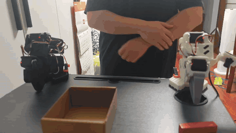

# SO-101 Autonomous Pick-and-Place with ACT

A real-world robotic manipulation demo using the **LeRobot SO-101** and **ACT (Action Chunking with Transformers)** for imitation learning.

> **Evaluation result:** The trained policy completed **8 consecutive autonomous pick-and-place cycles successfully**. The **9th attempt failed** and is retained as a real-world failure case.

## Demo

[](assets/evaluation-full.mp4)

**Quick preview:** 3 consecutive successful cycles at **1.5× speed** (26 seconds; GIF, approximately 9.1 MB). The excerpt covers 00:06–00:45 of the original recording and retains the manual object resets between autonomous cycles.

**[Watch or download the full continuous evaluation video](assets/evaluation-full.mp4)** — original MP4, approximately 2 min 3.53 s, 19.1 MB, normal speed, with audio.

The full recording shows **8 consecutive successful autonomous pick-and-place cycles followed by a failure on the 9th attempt**. All 9 attempts are retained without cuts or speed changes. This is one continuous demonstration, not a statistical success-rate estimate.

See [media details and preview-generation parameters](assets/README.md).

## Python Experiment Manager

The Python layer adds **typed configuration validation, read-only preflight checks, experiment logs, and verified checkpoint downloads** around LeRobot. ACT training and robot inference are provided by LeRobot; this repository implements the experiment workflow and deployment tooling.

```powershell
# Activate the pinned environment from docs/setup.md first.
python main.py init-config
# Edit configs/local.json: task, confirmed joint units, ports, cameras and paths.
python main.py check
python main.py record --config configs/local.json --dry-run
python main.py train --config configs/local.json --dry-run
python main.py rollout --config configs/local.json --dry-run
```

Follow the stage-specific checks in the **[Python usage guide](docs/python.md)** before removing `--dry-run`. Each actual execution records its resolved config, environment, console output and exit status under `runs/`. The original PowerShell scripts remain available below.

**[Public pretrained ACT model](https://huggingface.co/BoyuZhao/so101-act-pick-and-place)** — complete final checkpoint from the 40-episode, 120k-step training run, with normalization state. Read the [model provenance and deployment limits](docs/model.md), then download without putting large weights in Git:

```powershell
python main.py download-model
python main.py verify-model
```

Run the offline test suite with `python -m unittest discover -s tests -v`.

## Reproduction / Quick Start

Start with **[Windows setup, calibration and full reproduction guide](docs/setup.md)** and [environment provenance](docs/environment.md). These scripts target the author's inspected **JoyandAI/lerobot fork at `eacddcb9cff5e033c7811daa15d30f5debcc9a7b`**; CLI behavior differs across LeRobot versions.

1. Install the pinned environment and identify/calibrate your arms and cameras.
2. Collect demonstrations with [`scripts/record.ps1`](scripts/record.ps1).
3. Train ACT with [`scripts/train.ps1`](scripts/train.ps1).
4. Deploy a complete checkpoint with [`scripts/rollout.ps1`](scripts/rollout.ps1).

```powershell
# After installation/calibration; run from this repository root.
$units = Read-Host 'Confirmed joint units: true for degrees, false for normalized positions'
$task = Read-Host 'Describe your pick-and-place task'
.\scripts\record.ps1 -Task $task -UseDegrees $units -DryRun
.\scripts\train.ps1 -DryRun
.\scripts\rollout.ps1 -Task $task -UseDegrees $units -DryRun
```

`-DryRun` prints arguments without running LeRobot or moving hardware. Follow the setup guide, then remove it at each stage when ready. Paths, ports, camera indices and training settings are configurable. The full training dataset is not included; record your own data or obtain a complete copy. Pretrained weights are hosted separately on Hugging Face; see the model section above. Public availability of `BoyuZhao/so101_test` has not been verified. Historical joint units remain unconfirmed and must be established before deploying an existing checkpoint.

## Overview

This project implements an end-to-end imitation-learning workflow for autonomous robotic manipulation:

```text
Human teleoperation
        ↓
Demonstration collection
        ↓
LeRobot dataset
        ↓
ACT policy training
        ↓
Real-robot inference
        ↓
Autonomous pick-and-place
```

The goal was not only to train a policy offline, but to deploy it on physical hardware and evaluate repeated autonomous execution.

## System

| Component | Configuration |
| --- | --- |
| Robot | LeRobot SO-101 follower arm |
| Demonstration interface | SO-101 leader arm |
| Policy | ACT (Action Chunking with Transformers) |
| Framework | Hugging Face LeRobot |
| Learning paradigm | Imitation learning |
| Visual observations | Wrist camera + front camera |
| Robot state/action | 6-DoF joint state and action |
| Dataset rate | 30 FPS |
| Training framework | PyTorch |
| Compute | NVIDIA GeForce RTX 4070 Laptop GPU |

## Workflow

### 1. Teleoperation and Data Collection

Pick-and-place demonstrations were collected by teleoperating the SO-101 follower with an SO-101 leader arm. Robot state/action data and synchronized visual observations were recorded through LeRobot.

The training dataset contains **40 teleoperated demonstration episodes**.

### 2. ACT Policy Training

The demonstrations were used to train an ACT policy. ACT predicts chunks of future robot actions rather than a single action at each inference step, making it suitable for continuous manipulation trajectories.

### 3. Real-World Deployment

The trained checkpoint was deployed back onto the physical SO-101. During rollout, the policy receives camera observations and robot state and generates actions for the follower arm.

### 4. Continuous Evaluation

The policy completed **8 consecutive autonomous pick-and-place cycles successfully**. The **9th consecutive attempt failed**.

The failure is intentionally retained in the full evaluation video rather than removed. This provides a more transparent view of both repeated successful execution and a real-world failure case.

## Dataset & Training Configuration

### Dataset

- **40 teleoperated demonstration episodes**
- Dual-camera visual observations: wrist camera + front camera
- 6-DoF robot state/action
- Recording frequency: 30 FPS

### ACT Training

The ACT policy was trained with the following LeRobot configuration:

```powershell
lerobot-train `
  --dataset.repo_id=BoyuZhao/so101_test `
  --dataset.root="C:\Users\zby\.cache\huggingface\lerobot\BoyuZhao\so101_test_20260902_014234" `
  --dataset.streaming=false `
  --policy.type=act `
  --output_dir="C:\Users\zby\lerobot\outputs\train\act_so101_test_120k" `
  --job_name=act_so101_test_120k `
  --policy.device=cuda `
  --wandb.enable=false `
  --policy.push_to_hub=false `
  --steps=120000 `
  --batch_size=8 `
  --save_freq=10000 `
  --policy.use_amp=true
```

### Training Performance

- **Training steps:** 120,000
- **Batch size:** 8
- **Device:** CUDA
- **Automatic Mixed Precision (AMP):** enabled
- **Observed training throughput:** approximately **2.83 steps/s**

The throughput above is the observed training speed on the hardware used for this experiment and may vary across systems.

## What This Project Demonstrates

- End-to-end robot imitation-learning workflow
- Leader-follower teleoperation and demonstration collection
- Multi-camera visual observations
- ACT policy training with LeRobot and PyTorch
- CUDA and mixed-precision model training
- Deployment of a learned policy on a physical robot
- Real-world debugging of robot communication, camera pipelines, and inference
- Continuous evaluation including both successful executions and a retained failure case

## Repository Structure

```text
SO101-ACT-Pick-and-Place/
├── README.md
├── LICENSE
├── .gitignore
├── assets/          # Demo media
├── main.py          # Python command-line entry point
├── so101_act/       # Config, checks, execution logs and model management
├── configs/         # Experiment configuration template
├── models/          # Published model revision and SHA-256 manifest
├── tests/           # Offline Python tests
├── scripts/         # Original PowerShell record/train/rollout commands
└── docs/            # Additional setup and experiment notes
```

Demo media and processing details are available in `assets/`. Reproduction scripts are in `scripts/`; installation, configuration and environment notes are in `docs/`.

## Acknowledgements

This project is built with [Hugging Face LeRobot](https://github.com/huggingface/lerobot) and uses the SO-101 robot platform.

ACT is based on the Action Chunking with Transformers approach for learning fine-grained visuomotor policies from demonstrations.

## License

This repository is released under the [MIT License](LICENSE). Third-party projects and dependencies remain subject to their respective licenses.
